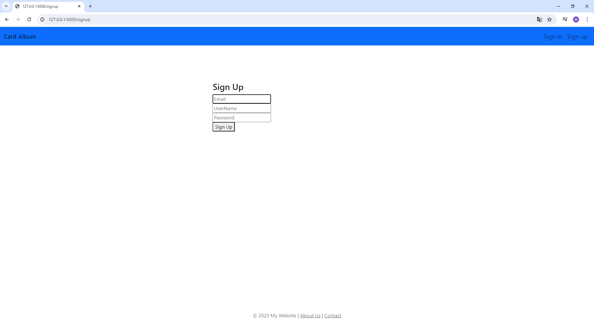
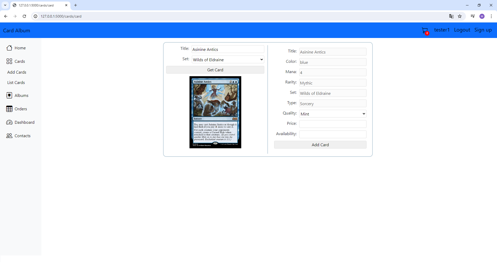
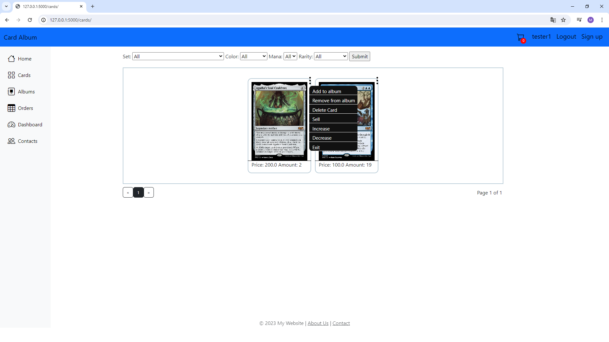
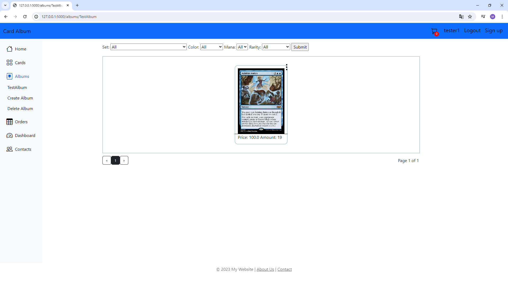
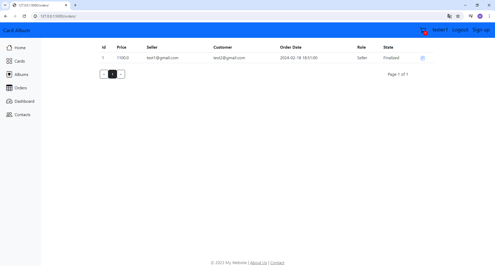
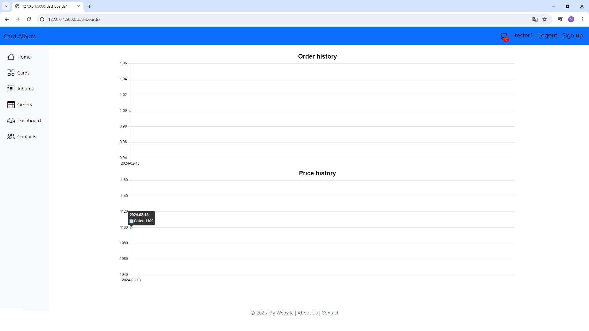
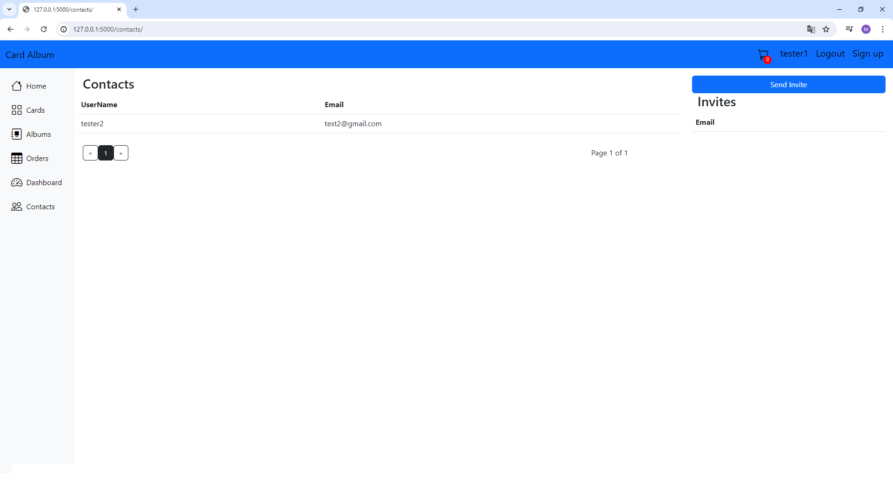
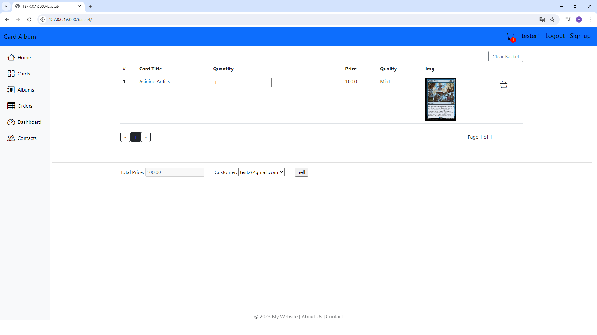

# CardAlbum

The application allows you to collect magic the gathering cards and sell them to other application users.
A collector is able to manage his or her collection through albums. 
He can only sell cards to users whom he has previously invited as friends.
The application allows you to monitor orders and the amount of money spent/earned.
Application data is stored in the database and images in a folder imitating a data lake.

# Table of Contents</h1>

 - [Intallation](#installation) 
 - [Explanation](#explanation) 
 - [Notes](#notes) 

## Intallation
---
    1. Download github project.
    2. Go to CardAlbum folder and run application using run.py file.

## Explanation
---
The application is of 2 services:

- Flask Application
- SQLite database

The user creates his account in the application.

 

In the Cards tab user manages his cards. 
Here you add cards by entering the card name and attachment.
The rest of the fields are completed automatically. After selecting card user is able to provide price, quality
and availability. Images of cards is taken from website by python BeautifulSoup module
and saved in folder imitate datalake.

 

The user can also manage his cards through appropriate options.

 

In the Albums tab, the user manages his albums.

 

The Orders tab allows you to preview orders.

 

The Dashboard tab allows you to monitor orders and the amount of money spent/earned.

 

The Contacts tab shows current contacts and invitations.

 

The shopping cart is used to create an order.

  
## Notes
---
